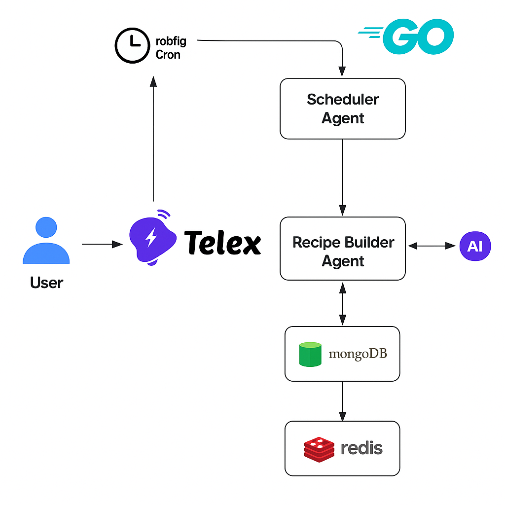

# Recipe Builder Agent


This project integrates with **[Telex](https://telex.im)** to deliver **AI-powered recipe recommendations**. It features three autonomous agents that communicate and collaborate to serve users personalized recipes through their Telex channel.


## Overview

The system provides intelligent recipe suggestions to users based on their input or scheduled meal times. It leverages **Go**, **MongoDB**, **Redis**, and **AI** to efficiently generate, cache, and deliver recipes.

### Agents Overview

| Agent                    | Description                                                                                                                                             |
| ------------------------ | ------------------------------------------------------------------------------------------------------------------------------------------------------- |
| **User Agent**           | The end-user interacting with the Telex channel. Requests recipes manually or receives scheduled recipes.                                               |
| **Scheduler Agent**      | Uses cron jobs to send recipes automatically at defined times (e.g., breakfast, lunch, dinner). Fetches data from cache or database.                    |
| **Recipe Builder Agent** | Checks cache for recipes and, if not available, generates new ones using an AI model (LLM). Newly generated recipes are stored in cache for future use. |

---

## Architecture



### Components:

* **Telex** – Messaging interface for user-agent communication
* **Go** – Main backend language
* **robfig/cron** – Scheduler for recurring recipe delivery
* **MongoDB** – Persistent storage for recipe data
* **Redis** – Caching layer to optimize performance and reduce LLM calls
* **AI (LLM)** – Generates new recipes when unavailable in cache


## Features

* 🤖 **AI-Powered Recipes:** Automatically generates recipes using large language models.
* **Smart Caching:** Avoids redundant API calls by caching recipe results.
* **Automated Scheduling:** Sends recipes at mealtime intervals via cron jobs.
* **Telex Integration:** Seamless interaction via user messages in the Telex app.
* **Scalable Design:** Built using Go for high performance and concurrency.


## Tech Stack

| Layer          | Technology                  |
| -------------- | --------------------------- |
| Language       | Go                          |
| Scheduler      | robfig/cron                 |
| Database       | MongoDB                     |
| Cache          | Redis                       |
| Messaging      | Telex                       |
| AI Integration | OpenAI / Local LLM endpoint |

---

## Installation & Setup

### 1. Clone the repository

```bash
git clone https://github.com/yourusername/recipe-builder-agent.git
cd recipe-builder-agent
```

### 2. Set up environment variables

Create a `.env` file in the root directory and configure:

```bash
MONGO_URI=<your_mongodb_connection>
REDIS_URI=<your_redis_connection>
TELEX_API_KEY=<your_telex_api_key>
AI_API_KEY=<your_ai_model_api_key>
```

### 3. Install dependencies

```bash
go mod tidy
```

### 4. Run the app

```bash
go run main.go
```

## Contributing

Contributions are welcome!

1. Fork the repository
2. Create a new branch (`feature/my-feature`)
3. Commit changes and open a pull request
